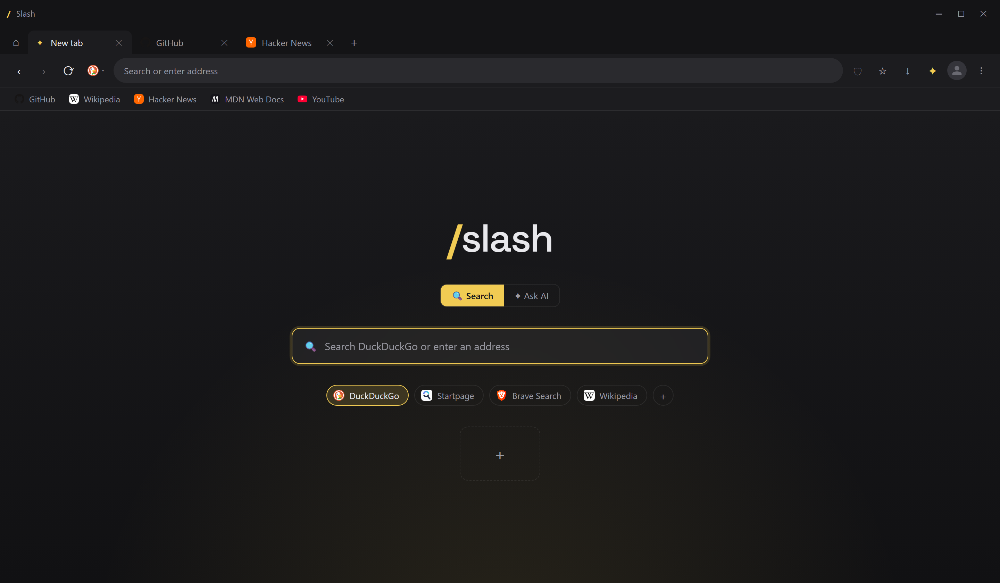
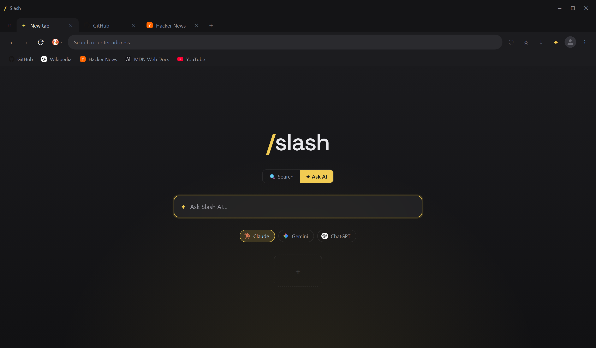

<p align="center">
  
</p>

<h1 align="center">Slash</h1>

<p align="center">
  An AI-native web browser that runs <em>for</em> you, on your machine, where nothing leaves and anyone can check.
</p>

<p align="center">
  
  
  
  
</p>

<p align="center">
  
</p>

---

## Why Slash

The browser is the app you live in, and it quietly became the most surveilled one you own. Almost every major browser is built or bankrolled by an ad company, so the thing rendering your bank, your messages, and your search history is run by people whose business is watching you. That isn't a bug in those browsers. It's the business model.

Now AI is being stuffed into browsers, and it's making that worse, not better. The "AI browser" everyone is shipping reads your tabs and sends them to someone's cloud. You get a smarter browser by handing over even more of yourself.

**Slash is the opposite bet: an AI-native browser where the AI actually works for you, and none of it works against you.** It has no ad business, no account, no telemetry, and nothing to sync to a cloud, so there is nothing harvesting you to begin with. The assistant can search, read pages, and act on the web on your behalf, but it runs on your machine with your key (or a free local CLI), and nothing you do ever touches a Slash server.

And because "trust me" is not good enough for the app that sees everything, the whole thing is open source. You don't have to take the privacy claim on faith. You can read it.

## What Slash offers

- **AI built in.** A docked side panel and a full-screen assistant that can actually use the web (search, read pages, open and navigate tabs), with your choice of a free CLI or your own API key.
- **Profiles that actually separate.** Work, School, Personal, each in its own window with its own logins, history, passwords, tabs, bookmarks, and extensions. Sign into an account in one and you are signed out in the others. No sign-in, all on your device.
- **Chrome extensions.** Install from the Chrome Web Store or load an unpacked folder; content blockers and most extensions work, per profile.
- **Private by default.** DuckDuckGo search, no account, no telemetry, nothing leaves your machine.
- **Ads and trackers blocked.** EasyList + EasyPrivacy, applied at the network layer so the spyware never loads.
- **Hardened connections.** HTTPS-only mode with a fallback warning page, plus encrypted DNS (DNS-over-HTTPS).
- **Permissions you control.** Camera, mic, location, and notifications are asked per site, not silently granted.
- **Secrets sealed on your device.** Passwords and API keys are encrypted at rest with the OS keystore (Windows DPAPI / macOS Keychain / Linux libsecret).
- **Built-in password manager.** Autofill that fills login forms without ever exposing the password to the page's own scripts.
- **One-click move-in.** Bring your bookmarks, history, sessions (stay signed in), and passwords over from another browser on your machine. Nothing is uploaded.
- **Open source.** Read it, audit it, or fork it. The privacy claims are checkable, not promises.

## How Slash actually protects you

Security here is layered, not a single feature:

- **A locked-down shell.** Web pages run sandboxed and context-isolated, with no Node access and no `webview` tag, behind a strict content-security-policy on every Slash UI page. The part that renders the web cannot reach your operating system, and a hacked page cannot escape into the browser's own UI.
- **The open engine without the surveillance layer.** Slash renders with Chromium, which is open source. What turns "Chromium" into "Chrome" is the Google services layered on top (sign-in, sync, telemetry, Safe Browsing pings). Slash uses the raw engine and leaves that layer off, configured not to phone home. The one deliberate exception is the Widevine DRM module, downloaded from Google so paid streaming plays; see [`PRIVACY.md`](PRIVACY.md).
- **Network hardening by default.** HTTPS-only with automatic upgrade, encrypted DNS, and tracker/ad blocking at the network layer.
- **Deny-by-default permissions.** Sensitive capabilities are gated behind a per-site prompt.
- **Local-only data.** History, bookmarks, passwords, and keys live on your device. Passwords and keys are encrypted with the OS keystore. There is no cloud sync because there is no cloud.
- **A leashed AI.** It only touches the web when you ask it to act. Its tools (search, read a page, open a tab) run on your own key or a free local CLI in normal permission mode, with no autonomous bypass and no background access to your browsing. Nothing is sent in the background.

### What Slash does not do

The honest boundary is what makes the rest credible:

- It cannot make the sites you log into forget you. Sign into Gmail and Google still knows you are on Gmail. Slash kills the browser-level spying and blocks third-party trackers. It does not make the web anonymous.
- It is not Tor or a VPN. Your network and ISP still see which servers you connect to (DNS is encrypted, the connections are not hidden). A proxy option is on the roadmap, not in yet.
- Your search engine still sees your searches, and your chosen AI provider sees whatever the assistant sends it when you ask it to do something. That only happens on your request, never in the background.
- It cannot stream Netflix or Disney+ in 1080p or 4K. Paid streaming plays, but at software-DRM quality (roughly SD to 720p), because high-definition DRM needs hardware support (Widevine L1) that only OS-native browsers and devices get. Music, YouTube, and non-DRM video are full quality.

Slash removes the browser as the surveillance machine and shields you from trackers. It does not pretend to make you invisible.

## The AI

<p align="center">
  
</p>

Pick your provider (Claude, Gemini, or ChatGPT) and how it runs:

- **CLI (free).** Spawned via [Squire](https://github.com/PythonLuvr/squire) on your existing subscription. No API key, no per-token cost. Free CLIs can even drive the browser through a local [MCP](https://modelcontextprotocol.io) bridge, so the assistant can search the web, read the current page, and open tabs for you.
- **API (BYOK).** A direct streaming call with a key you add in Settings. Keys are encrypted locally and never sent anywhere but the provider you pick.

Toggle the side panel with `Ctrl+J`, or open the full-screen assistant from the start page. Model ids are editable defaults, not baked in.

## Install and run

Requires [Node.js](https://nodejs.org/) 20 or newer.

```bash
npm install
npm start
```

### Build an installer

```bash
npm run dist
```

This produces a packaged build (Windows NSIS installer, macOS dmg, or Linux AppImage) named **Slash** with the app icon. Default-browser registration only works from the installed build, not from `npm start`.

### Installing the released build on Windows

The installer is **not code-signed** (signing certificates cost money, and Slash
is free and open source). So on first run Windows SmartScreen shows a blue
"Windows protected your PC" screen. This is expected for an unsigned open-source
app. Click **More info**, then **Run anyway**. The code is all here for you to
read if you would rather build it yourself.

## Configure AI

- Toggle the panel with the spark icon in the toolbar or `Ctrl+J`.
- Use the picker to choose a provider and switch between **CLI** and **API**.
- Open Settings to add API keys, set model ids, and toggle the privacy options. CLI variants need no key.

## How it is built

- **Electron** with `BaseWindow` and stacked `WebContentsView`s: Slash owns its UI and rents the Chromium engine. It is not a Chromium fork. Web content runs in sandboxed, isolated, preload-free views; the trusted UI views get a narrow IPC bridge.
- **CLI AI** runs through Squire, which spawns the provider CLI as a subprocess and streams typed events. **API AI** streams Server-Sent Events directly from each provider.
- **The browser as a tool:** a local MCP server exposes safe browser actions (search, read page, navigate, bookmark) so any MCP-aware CLI can act on the web through Slash.
- **Local data:** settings, bookmarks, and history live in the OS app-data directory. API keys and passwords are encrypted with `safeStorage`. Nothing personal is ever written into this repo.

See [`PRIVACY.md`](PRIVACY.md) for the full security model and roadmap, [`DESIGN.md`](DESIGN.md) for the visual system, and [`RELEASING.md`](RELEASING.md) for the release process.

## Contributing

Slash is open source and meant to be hackable. Issues and pull requests are welcome. Nothing in the repo is hardcoded to one person or machine: bring your own keys, bring your own AI subscription, and everything works.

## License

Slash's own source code is **[MIT](LICENSE)**, reuse any of it freely. The
**distributed application is GPL-3.0**, because it bundles
[`electron-chrome-extensions`](https://github.com/samuelmaddock/electron-browser-shell)
(GPL-3.0) for Chrome extension support. In short: the code you read in this repo
is MIT, but the built and installed app is copyleft, so any redistribution of
the app itself must stay open source.
